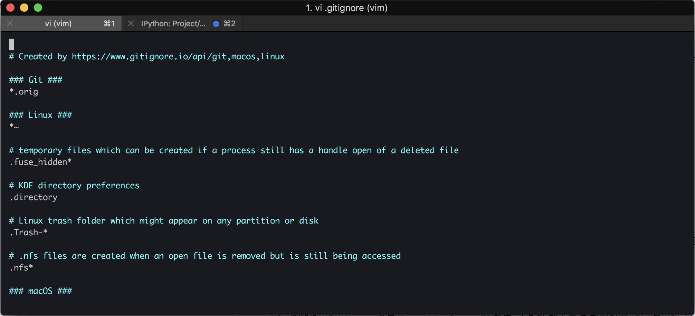

# 개발환경 설정(for Mac)
- 기본 개발환경
	- Homebrew
	- iterm2
	- zsh
	- oh-my-zsh
	- vim
	- vim Highlight
	- git
	- tree
	- Atom Editer

- python, Django 개발환경
	- python3
	- pyenv
	- pipenv
	- pycharm


## Homebrew install
Homebrew는 패키지 관리자다. 개발하는 Mac 유저는 brew 를 무조건 깔고 시작한다. 자세한 설명은 Homebrew 홈페이지에서 긁어왔다.

### Homebrew summary
홈브류는 오픈 소스 소프트웨어 패키지 관리 시스템의 하나로서 애플의 macOS 운영 체제의 소프트웨어 설치를 단순하게 만들어 줍니다. 원래 맥스 호웰이 개발한 이 패키지 관리자는 루비 온 웨일즈 공동체에서 인기를 얻었으며 확장성으로 호평을 받았다.

홈브루는 쉬운 사용성, 명령 줄로의 통합이 가능하므로 이용이 권장된다. 홈브루는 깃허브를 활용하여 사용자 기여를 통한 여러 패키지들의 지원을 확장한다.

### install

```zsh
xcode-select --install
```
설치 전 Xcode 개발자 도구가 설치되어 있어야한다.

```zsh
/usr/bin/ruby -e "$(curl -fsSL https://raw.githubusercontent.com/Homebrew/install/master/install)"
```
터미널에 복사/붙여넣기 후 엔터를 입력하면 설치가 시작된다.

```zsh
brew install nodejs
```
전부 설치후 필요한 패키지를 `brew install {패키지 이름}` 으로 설치한다.

## vim install
vim은 터미널 내부에서 간단하게 code 를 편집할때 자주 사용하는 기능이다. mac 에는 기본적으로 `vi` 라는 비슷한 패키지가 이미 설치되어 있는데 vim 을 설치해주면 좀더 편리하게 사용할 수 있다. 자세한 설명은 위키에서 긁어왔다.

### vim summary
Vim(빔[1], Vi IMproved)은 Bram Moolenaar가 만든 vi 호환 텍스트 편집기이다. CUI용 Vim과 GUI용 gVim이 있다. 본래 아미가 컴퓨터 용 프로그램이었으나 현재는 마이크로소프트 윈도, 리눅스, 맥 오에스 텐을 비롯한 여러 환경을 지원한다.

Vim은 vi와 호환되면서도 독자적으로 다양한 기능을 추가하여 사용자의 편의를 돕고 있다. 특히 Vim 스크립트 등을 사용해서 자유롭게 편집 환경을 변경하거나, 확장된 정규 표현식 문법, 강력한 문법 강조 기능, 다중 되돌리기, 유니코드를 비롯한 다국어 지원, 문법 검사 등을 쓸 수 있다는 점이 강점으로 꼽힌다. 한편으로는 vi와 마찬가지로 처음에 배우기 어렵다는 점이 단점으로 지적되는데, 이를 극복하기 위해 쉬운 Vim 모드를 지원한다.

### install
```zsh
brew install vim
```
brew 로 설치한다.

## vim Highlight Setting

vim 을 그냥 쓰기에는 너무 밑밑하다. 해당하는 code 의 형식에 맞게 색깔별로 higlight 를 넣어주는 기능을 활성화 하자.